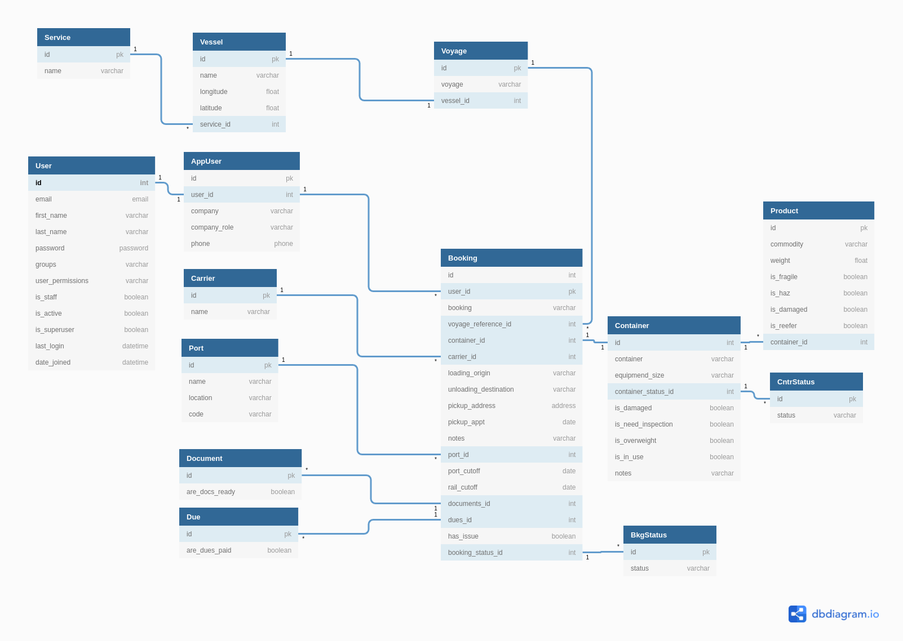

# Project

ShipItOut is my full stack NSS C46 capstone project. It is related to my initial project, [PackItUp](https://github.com/CheoR/pack-it-up) - track what you pack, app.

ShipItOut consist of React front-end and Django backend.

It is a dashboard-like app that tracks shipping containers where the shipper, container, port authorities can update the container status as it moves.

Link to frontend repo [here](https://github.com/CheoR/shipItOut-client).

## Motivation

I come from the transportation/logistics/freight shipping industries and often times the tools we used to track maintenace/inventory/shipments were clunky and outdated.

This is a simple version of something I would wanted to use.

## Prerequisites

### Mac OS

```sh
brew install libtiff libjpeg webp little-cms2
```

### Linux (WSL)

```sh
sudo apt-get install libtiff5-dev libjpeg8-dev libopenjp2-7-dev zlib1g-dev \
    libfreetype6-dev liblcms2-dev libwebp-dev tcl8.6-dev tk8.6-dev python3-tk \
    libharfbuzz-dev libfribidi-dev libxcb1-dev
```

## Setup

1.  Clone this repository and change to the directory in the terminal.
2.  Run `pipenv shell`
3.  Run `pipenv install`
4.  Set up variables for your local postgres db. These are referenced in settings.

    $ mv .env.example .env

5.  Create your db

    $ sudo -u postgres psql

where you will see the `psql` prompt

    psql (10.17 (Ubuntu 10.17-1.pgdg16.04+1), server 9.4.26)
    Type "help" for help.

    postgres=#

Then create your database, user, and give them privilages. Quit when done.

    CREATE DATABASE {from your .env file};
    CREATE USER {from your .env file} WITH PASSWORD {from your .env file};
    GRANT ALL PRIVILEGES ON DATABASE {from your .env file} TO {from your .env file};
    \q

To verify, reconnect with:

    $ psql --host=localhost --dbname={from your .env file} --username={from your .env file}

7.  Before running server make sure to update `local.py` file in `settings` to fit your localhost.

    $ mv shipItOutServer/settings/local.py.example shipItOutServer/settings/local.py

8.  Run migrations and migrate for app

    $ python3 manage.py makemigrations api
    $ python3 manage.py migrate

9.  Type this exact thing into the terminal to run the migrations and seed the database: `./seed_data.sh` and run with

        $ bash seed_data.sh

## Project ERD

Open the [Latest ShipItOut db diagram](https://dbdiagram.io/d/60be3bdfb29a09603d1855af) in the browser to view the tables and relationships for the database.

<details>
  
</details>
